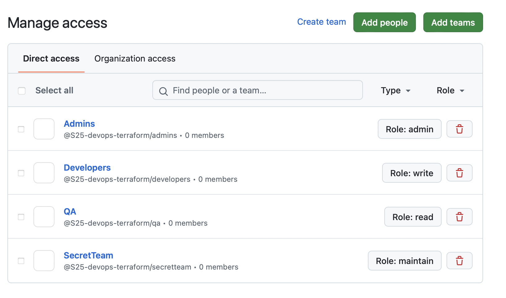

# Overview

## Docker

In the task requirement was not specified which app to deploy with terraform, so I deployed both (`app_python` and `app_java`)

1. Execution of `terraform state list`

    ```bash
      docker_container.node_container
      docker_container.python_container
      docker_image.node_app
      docker_image.python_app
    ```

2. Execution of `terraform state show docker_container.python_container`

    ```bash
      # docker_container.python_container:
      resource "docker_container" "python_container" {
          attach                                      = false
          bridge                                      = null
          command                                     = [
              "python3",
              "app.py",
          ]
          container_read_refresh_timeout_milliseconds = 15000
          cpu_set                                     = null
          cpu_shares                                  = 0
          domainname                                  = null
          entrypoint                                  = []
          env                                         = []
          hostname                                    = "34deebe40130"
          id                                          = "34deebe4013039295ef83c20634c914fb1b70fef5b340888f987c5e66e16c9bf"
          image                                       = "sha256:2ad58fe0e6345bcee281b0f67a00718de166e00b7d77574bbea2103237bda012"
          init                                        = false
          ipc_mode                                    = "private"
          log_driver                                  = "json-file"
          logs                                        = false
          max_retry_count                             = 0
          memory                                      = 0
          memory_swap                                 = 0
          must_run                                    = true
          name                                        = "app_python"
          network_data                                = [
              {
                  gateway                   = "172.17.0.1"
                  global_ipv6_address       = null
                  global_ipv6_prefix_length = 0
                  ip_address                = "172.17.0.2"
                  ip_prefix_length          = 16
                  ipv6_gateway              = null
                  mac_address               = "02:42:ac:11:00:02"
                  network_name              = "bridge"
              },
          ]
          network_mode                                = "default"
          pid_mode                                    = null
          privileged                                  = false
          publish_all_ports                           = false
          read_only                                   = false
          remove_volumes                              = true
          restart                                     = "no"
          rm                                          = false
          runtime                                     = "runc"
          security_opts                               = []
          shm_size                                    = 64
          start                                       = true
          stdin_open                                  = false
          stop_signal                                 = null
          stop_timeout                                = 0
          tty                                         = false
          user                                        = "app_python_user"
          userns_mode                                 = null
          wait                                        = false
          wait_timeout                                = 60
          working_dir                                 = "/app_python"

          ports {
              external = 5001
              internal = 5000
              ip       = "0.0.0.0"
              protocol = "tcp"
          }
      }
    ```

3. Execution `terraform state show docker_container.node_container`

    ```bash
      # docker_container.node_container:
      resource "docker_container" "node_container" {
          attach                                      = false
          bridge                                      = null
          command                                     = [
              "node",
              "app.js",
          ]
          container_read_refresh_timeout_milliseconds = 15000
          cpu_set                                     = null
          cpu_shares                                  = 0
          domainname                                  = null
          entrypoint                                  = [
              "docker-entrypoint.sh",
          ]
          env                                         = []
          hostname                                    = "8d3eee95310f"
          id                                          = "8d3eee95310fd465f05af143cc539996ec39d192f37eacf57d9ea8d75b3c58b4"
          image                                       = "sha256:b8b6db326d2e9fd630fea846c11587cf3b3dbaa2e1c83bb456922f6decee02f2"
          init                                        = false
          ipc_mode                                    = "private"
          log_driver                                  = "json-file"
          logs                                        = false
          max_retry_count                             = 0
          memory                                      = 0
          memory_swap                                 = 0
          must_run                                    = true
          name                                        = "app_nodejs"
          network_data                                = [
              {
                  gateway                   = "172.17.0.1"
                  global_ipv6_address       = null
                  global_ipv6_prefix_length = 0
                  ip_address                = "172.17.0.3"
                  ip_prefix_length          = 16
                  ipv6_gateway              = null
                  mac_address               = "02:42:ac:11:00:03"
                  network_name              = "bridge"
              },
          ]
          network_mode                                = "default"
          pid_mode                                    = null
          privileged                                  = false
          publish_all_ports                           = false
          read_only                                   = false
          remove_volumes                              = true
          restart                                     = "no"
          rm                                          = false
          runtime                                     = "runc"
          security_opts                               = []
          shm_size                                    = 64
          start                                       = true
          stdin_open                                  = false
          stop_signal                                 = null
          stop_timeout                                = 0
          tty                                         = false
          user                                        = "nonrootuser"
          userns_mode                                 = null
          wait                                        = false
          wait_timeout                                = 60
          working_dir                                 = "/app_nodejs"

          ports {
              external = 3000
              internal = 3000
              ip       = "0.0.0.0"
              protocol = "tcp"
          }
      }
    ```

4. Execution of `terraform apply`

    ```bash
      docker_image.python_app: Refreshing state... [id=sha256:b3cd6feced8137fbd6a18840bbf0f1e1f45516546f0fb5d6488128a1a7338362python:3.11]
      docker_image.node_app: Refreshing state... [id=sha256:8b665fc4f032e5b6f6f3386c26df3c4844ff72667b502863ce9a67d385f4d489node:18]

      Terraform used the selected providers to generate the following execution plan. Resource actions are indicated with the following symbols:
        + create

      Terraform will perform the following actions:

        # docker_container.node_container will be created
        + resource "docker_container" "node_container" {
            + attach                                      = false
            + bridge                                      = (known after apply)
            + command                                     = (known after apply)
            + container_logs                              = (known after apply)
            + container_read_refresh_timeout_milliseconds = 15000
            + entrypoint                                  = (known after apply)
            + env                                         = (known after apply)
            + exit_code                                   = (known after apply)
            + hostname                                    = (known after apply)
            + id                                          = (known after apply)
            + image                                       = "ilsiia/app_nodejs:latest"
            + init                                        = (known after apply)
            + ipc_mode                                    = (known after apply)
            + log_driver                                  = (known after apply)
            + logs                                        = false
            + must_run                                    = true
            + name                                        = "app_nodejs"
            + network_data                                = (known after apply)
            + read_only                                   = false
            + remove_volumes                              = true
            + restart                                     = "no"
            + rm                                          = false
            + runtime                                     = (known after apply)
            + security_opts                               = (known after apply)
            + shm_size                                    = (known after apply)
            + start                                       = true
            + stdin_open                                  = false
            + stop_signal                                 = (known after apply)
            + stop_timeout                                = (known after apply)
            + tty                                         = false
            + wait                                        = false
            + wait_timeout                                = 60

            + healthcheck (known after apply)

            + labels (known after apply)

            + ports {
                + external = 3000
                + internal = 3000
                + ip       = "0.0.0.0"
                + protocol = "tcp"
              }
          }

        # docker_container.python_container will be created
        + resource "docker_container" "python_container" {
            + attach                                      = false
            + bridge                                      = (known after apply)
            + command                                     = (known after apply)
            + container_logs                              = (known after apply)
            + container_read_refresh_timeout_milliseconds = 15000
            + entrypoint                                  = (known after apply)
            + env                                         = (known after apply)
            + exit_code                                   = (known after apply)
            + hostname                                    = (known after apply)
            + id                                          = (known after apply)
            + image                                       = "ilsiia/app_python:latest"
            + init                                        = (known after apply)
            + ipc_mode                                    = (known after apply)
            + log_driver                                  = (known after apply)
            + logs                                        = false
            + must_run                                    = true
            + name                                        = "app_python"
            + network_data                                = (known after apply)
            + read_only                                   = false
            + remove_volumes                              = true
            + restart                                     = "no"
            + rm                                          = false
            + runtime                                     = (known after apply)
            + security_opts                               = (known after apply)
            + shm_size                                    = (known after apply)
            + start                                       = true
            + stdin_open                                  = false
            + stop_signal                                 = (known after apply)
            + stop_timeout                                = (known after apply)
            + tty                                         = false
            + wait                                        = false
            + wait_timeout                                = 60

            + healthcheck (known after apply)

            + labels (known after apply)

            + ports {
                + external = 5001
                + internal = 5000
                + ip       = "0.0.0.0"
                + protocol = "tcp"
              }
          }

      Plan: 2 to add, 0 to change, 0 to destroy.

      Do you want to perform these actions?
        Terraform will perform the actions described above.
        Only 'yes' will be accepted to approve.

        Enter a value: yes

      docker_container.node_container: Creating...
      docker_container.python_container: Creating...
      docker_container.node_container: Creation complete after 1s [id=8d3eee95310fd465f05af143cc539996ec39d192f37eacf57d9ea8d75b3c58b4]
      docker_container.python_container: Creation complete after 1s [id=34deebe4013039295ef83c20634c914fb1b70fef5b340888f987c5e66e16c9bf]

      Apply complete! Resources: 2 added, 0 changed, 0 destroyed.
    ```

5. Execution of `terraform output`

    ```bash
      Outputs:

      node_container_id = "376ec66f9402c45ee45f5662986541014e29d7172b9291be61aab70893f0fc86"
      node_container_image = "ilsiia/app_nodejs:latest"
      node_container_ip = "172.17.0.2"
      node_container_name = "app_nodejs"
      node_container_port = 3000
      python_container_id = "3362b897ba28a7950501994f85886caf353306100d0d2003eead44be1dda4120"
      python_container_image = "ilsiia/app_python:latest"
      python_container_ip = "172.17.0.3"
      python_container_name = "app_python"
      python_container_port = 5001
    ```

## Yandex

I followed the guide `https://yandex.cloud/en-ru/docs/tutorials/infrastructure-management/terraform-quickstart#linux_1` and also created payment accoung to receive grant. During this task I came up with several difficulties. I messed up with a lot of ids and after several attempts to run `terraform apply` free attempts for creating networks, subnets and vms were out. So I had to deal with it and clean everything I had on my account.

1. Execution of `terraform plan`

    ```bash
      Terraform used the selected providers to generate the following execution plan. Resource actions are indicated with the
      following symbols:
        + create

      Terraform will perform the following actions:

        # yandex_compute_instance.vm-1 will be created
        + resource "yandex_compute_instance" "vm-1" {
            + created_at                = (known after apply)
            + folder_id                 = (known after apply)
            + fqdn                      = (known after apply)
            + gpu_cluster_id            = (known after apply)
            + hardware_generation       = (known after apply)
            + hostname                  = (known after apply)
            + id                        = (known after apply)
            + maintenance_grace_period  = (known after apply)
            + maintenance_policy        = (known after apply)
            + metadata                  = {
                + "ssh-keys" = <<-EOT
                      ubuntu:ssh-ed25519 AAAAC3NzaC.....Y0eoh ilsiyanasibullina@gmail.com
                  EOT
              }
            + name                      = "terraform-vm-1"
            + network_acceleration_type = "standard"
            + platform_id               = "standard-v1"
            + service_account_id        = (known after apply)
            + status                    = (known after apply)
            + zone                      = (known after apply)

            + boot_disk {
                + auto_delete = true
                + device_name = (known after apply)
                + disk_id     = (known after apply)
                + mode        = (known after apply)

                + initialize_params {
                    + block_size  = (known after apply)
                    + description = (known after apply)
                    + image_id    = "fd800c7s2p483i648ifv"
                    + name        = (known after apply)
                    + size        = 20
                    + snapshot_id = (known after apply)
                    + type        = "network-hdd"
                  }
              }

            + metadata_options (known after apply)

            + network_interface {
                + index              = (known after apply)
                + ip_address         = (known after apply)
                + ipv4               = true
                + ipv6               = (known after apply)
                + ipv6_address       = (known after apply)
                + mac_address        = (known after apply)
                + nat                = true
                + nat_ip_address     = (known after apply)
                + nat_ip_version     = (known after apply)
                + security_group_ids = (known after apply)
                + subnet_id          = (known after apply)
              }

            + placement_policy (known after apply)

            + resources {
                + core_fraction = 100
                + cores         = 2
                + memory        = 2
              }

            + scheduling_policy (known after apply)
          }

        # yandex_vpc_network.network-1 will be created
        + resource "yandex_vpc_network" "network-1" {
            + created_at                = (known after apply)
            + default_security_group_id = (known after apply)
            + folder_id                 = (known after apply)
            + id                        = (known after apply)
            + labels                    = (known after apply)
            + name                      = "default-1"
            + subnet_ids                = (known after apply)
          }

        # yandex_vpc_subnet.subnet-1 will be created
        + resource "yandex_vpc_subnet" "subnet-1" {
            + created_at     = (known after apply)
            + folder_id      = (known after apply)
            + id             = (known after apply)
            + labels         = (known after apply)
            + name           = (known after apply)
            + network_id     = (known after apply)
            + v4_cidr_blocks = [
                + "10.131.0.0/24",
              ]
            + v6_cidr_blocks = (known after apply)
            + zone           = "ru-central1-b"
          }

      Plan: 3 to add, 0 to change, 0 to destroy.
    ```

2. Execution of `terraform apply`

    ```bash
      Terraform used the selected providers to generate the following execution plan. Resource actions are indicated with the
      following symbols:
        + create

      Terraform will perform the following actions:

        # yandex_compute_instance.vm-1 will be created
        + resource "yandex_compute_instance" "vm-1" {
            + created_at                = (known after apply)
            + folder_id                 = (known after apply)
            + fqdn                      = (known after apply)
            + gpu_cluster_id            = (known after apply)
            + hardware_generation       = (known after apply)
            + hostname                  = (known after apply)
            + id                        = (known after apply)
            + maintenance_grace_period  = (known after apply)
            + maintenance_policy        = (known after apply)
            + metadata                  = {
                + "ssh-keys" = <<-EOT
                      ubuntu:ssh-ed25519 AAAAC3...tMY0eoh ilsiyanasibullina@gmail.com
                  EOT
              }
            + name                      = "terraform-vm-1"
            + network_acceleration_type = "standard"
            + platform_id               = "standard-v1"
            + service_account_id        = (known after apply)
            + status                    = (known after apply)
            + zone                      = (known after apply)

            + boot_disk {
                + auto_delete = true
                + device_name = (known after apply)
                + disk_id     = (known after apply)
                + mode        = (known after apply)

                + initialize_params {
                    + block_size  = (known after apply)
                    + description = (known after apply)
                    + image_id    = "fd800c7s2p483i648ifv"
                    + name        = (known after apply)
                    + size        = 20
                    + snapshot_id = (known after apply)
                    + type        = "network-hdd"
                  }
              }

            + metadata_options (known after apply)

            + network_interface {
                + index              = (known after apply)
                + ip_address         = (known after apply)
                + ipv4               = true
                + ipv6               = (known after apply)
                + ipv6_address       = (known after apply)
                + mac_address        = (known after apply)
                + nat                = true
                + nat_ip_address     = (known after apply)
                + nat_ip_version     = (known after apply)
                + security_group_ids = (known after apply)
                + subnet_id          = (known after apply)
              }

            + placement_policy (known after apply)

            + resources {
                + core_fraction = 100
                + cores         = 2
                + memory        = 2
              }

            + scheduling_policy (known after apply)
          }

        # yandex_vpc_network.network-1 will be created
        + resource "yandex_vpc_network" "network-1" {
            + created_at                = (known after apply)
            + default_security_group_id = (known after apply)
            + folder_id                 = (known after apply)
            + id                        = (known after apply)
            + labels                    = (known after apply)
            + name                      = "default-1"
            + subnet_ids                = (known after apply)
          }

        # yandex_vpc_subnet.subnet-1 will be created
        + resource "yandex_vpc_subnet" "subnet-1" {
            + created_at     = (known after apply)
            + folder_id      = (known after apply)
            + id             = (known after apply)
            + labels         = (known after apply)
            + name           = (known after apply)
            + network_id     = (known after apply)
            + v4_cidr_blocks = [
                + "10.131.0.0/24",
              ]
            + v6_cidr_blocks = (known after apply)
            + zone           = "ru-central1-b"
          }

      Plan: 3 to add, 0 to change, 0 to destroy.
      yandex_vpc_network.network-1: Creating...
      yandex_vpc_network.network-1: Creation complete after 4s [id=enpv8co8mmap3b4082ug]
      yandex_vpc_subnet.subnet-1: Creating...
      yandex_vpc_subnet.subnet-1: Creation complete after 1s [id=e2l64uv00rgch8lfhp9h]
      yandex_compute_instance.vm-1: Creating...
      yandex_compute_instance.vm-1: Still creating... [10s elapsed]
      yandex_compute_instance.vm-1: Still creating... [20s elapsed]
      yandex_compute_instance.vm-1: Still creating... [30s elapsed]
      yandex_compute_instance.vm-1: Still creating... [40s elapsed]
      yandex_compute_instance.vm-1: Still creating... [50s elapsed]
      yandex_compute_instance.vm-1: Creation complete after 52s [id=epde3epsabo34tur1b8p]

      Apply complete! Resources: 3 added, 0 changed, 0 destroyed.
    ```

3. Exection of `terraform state list`

    ```bash
      yandex_compute_instance.vm-1
      yandex_vpc_network.network-1
      yandex_vpc_subnet.subnet-1
    ```

4. Execution of `terraform state show yandex_vpc_network.network-1`

    ```bash
      # yandex_vpc_network.network-1:
      resource "yandex_vpc_network" "network-1" {
          created_at                = "2025-02-05T07:57:10Z"
          default_security_group_id = "enp93a2sd6gmqio445qk"
          description               = null
          folder_id                 = "b1g5rr7vs8qnd5ikd5ee"
          id                        = "enpv8co8mmap3b4082ug"
          labels                    = {}
          name                      = "default-1"
          subnet_ids                = []
      }
    ```

5. Execution of `terraform state show yandex_vpc_subnet.subnet-1`

    ```bash
      # yandex_vpc_subnet.subnet-1:
      resource "yandex_vpc_subnet" "subnet-1" {
          created_at     = "2025-02-05T07:57:13Z"
          description    = null
          folder_id      = "b1g5rr7vs8qnd5ikd5ee"
          id             = "e2l64uv00rgch8lfhp9h"
          labels         = {}
          name           = null
          network_id     = "enpv8co8mmap3b4082ug"
          route_table_id = null
          v4_cidr_blocks = [
              "10.131.0.0/24",
          ]
          v6_cidr_blocks = []
          zone           = "ru-central1-b"
      }
    ```

6. Execution of `terraform state show yandex_compute_instance.vm-1`

    ```bash
      # yandex_compute_instance.vm-1:
      resource "yandex_compute_instance" "vm-1" {
          created_at                = "2025-02-05T07:57:14Z"
          description               = null
          folder_id                 = "b1g5rr7vs8qnd5ikd5ee"
          fqdn                      = "epde3epsabo34tur1b8p.auto.internal"
          gpu_cluster_id            = null
          hardware_generation       = [
              {
                  generation2_features = []
                  legacy_features      = [
                      {
                          pci_topology = "PCI_TOPOLOGY_V1"
                      },
                  ]
              },
          ]
          hostname                  = null
          id                        = "epde3epsabo34tur1b8p"
          maintenance_grace_period  = null
          metadata                  = {
              "ssh-keys" = <<-EOT
                  ubuntu:ssh-ed25519 AAAA....0eoh ilsiyanasibullina@gmail.com
              EOT
          }
          name                      = "terraform-vm-1"
          network_acceleration_type = "standard"
          platform_id               = "standard-v1"
          service_account_id        = null
          status                    = "running"
          zone                      = "ru-central1-b"

          boot_disk {
              auto_delete = true
              device_name = "epdg669p39kd4a20vic3"
              disk_id     = "epdg669p39kd4a20vic3"
              mode        = "READ_WRITE"

              initialize_params {
                  block_size  = 4096
                  description = null
                  image_id    = "fd800c7s2p483i648ifv"
                  kms_key_id  = null
                  name        = null
                  size        = 20
                  snapshot_id = null
                  type        = "network-hdd"
              }
          }

          metadata_options {
              aws_v1_http_endpoint = 1
              aws_v1_http_token    = 2
              gce_http_endpoint    = 1
              gce_http_token       = 1
          }

          network_interface {
              index              = 0
              ip_address         = "10.131.0.32"
              ipv4               = true
              ipv6               = false
              ipv6_address       = null
              mac_address        = "d0:0d:e1:bb:3c:52"
              nat                = true
              nat_ip_address     = "158.160.64.42"
              nat_ip_version     = "IPV4"
              security_group_ids = []
              subnet_id          = "e2l64uv00rgch8lfhp9h"
          }

          placement_policy {
              host_affinity_rules       = []
              placement_group_id        = null
              placement_group_partition = 0
          }

          resources {
              core_fraction = 100
              cores         = 2
              gpus          = 0
              memory        = 2
          }

          scheduling_policy {
              preemptible = false
          }
      }
    ```

## Github

1. Execution of `terraform plan -out deploy.tfplan`

    ```bash
      var.token
        GitHub personal access token

        Enter a value: 

      github_repository.repo: Refreshing state... [id=my-terraform-repo]

      Terraform used the selected providers to generate the following execution plan. Resource actions are 
      indicated with the
      following symbols:
        + create

      Terraform will perform the following actions:

        # github_branch_default.default will be created
        + resource "github_branch_default" "default" {
            + branch     = "main"
            + id         = (known after apply)
            + repository = "my-terraform-repo"
          }

        # github_branch_protection.default will be created
        + resource "github_branch_protection" "default" {
            + allows_deletions                = false
            + allows_force_pushes             = false
            + blocks_creations                = false
            + enforce_admins                  = true
            + id                              = (known after apply)
            + pattern                         = "main"
            + repository_id                   = "my-terraform-repo"
            + require_conversation_resolution = true
            + require_signed_commits          = false
            + required_linear_history         = false

            + required_pull_request_reviews {
                + required_approving_review_count = 1
              }
          }

      Plan: 2 to add, 0 to change, 0 to destroy.
    ```

2. Execution of `terraform apply "deploy.tfplan"`

    ```bash  
      github_branch_default.default: Creating...
      github_branch_default.default: Creation complete after 2s [id=my-terraform-repo]
      github_branch_protection.default: Creating...
      github_branch_protection.default: Creation complete after 4s [id=BPR_kwDON0ssZ84Dibcb]

      Apply complete! Resources: 2 added, 0 changed, 0 destroyed.
    ```

3. Execution of `terraform state list`

    ```bash
      github_branch_default.default
      github_branch_protection.default
      github_repository.repo
    ```

4. Execution of `terraform state show github_branch_default.default`

    ```bash
      # github_branch_default.default:
      resource "github_branch_default" "default" {
          branch     = "main"
          id         = "my-terraform-repo"
          repository = "my-terraform-repo"
      }
    ```

5. Execution of `terraform state show github_branch_protection.default`

    ```bash
      # github_branch_protection.default:
      resource "github_branch_protection" "default" {
          allows_deletions                = false
          allows_force_pushes             = false
          blocks_creations                = false
          enforce_admins                  = true
          id                              = "BPR_kwDON0ssZ84Dibcb"
          pattern                         = "main"
          repository_id                   = "my-terraform-repo"
          require_conversation_resolution = true
          require_signed_commits          = false
          required_linear_history         = false

          required_pull_request_reviews {
              dismiss_stale_reviews           = false
              require_code_owner_reviews      = false
              required_approving_review_count = 1
              restrict_dismissals             = false
          }
      }
    ```

6. Execution of `terraform state show github_repository.repo`

    ```bash
      # github_repository.repo:
      resource "github_repository" "repo" {
          allow_auto_merge            = false
          allow_merge_commit          = true
          allow_rebase_merge          = true
          allow_squash_merge          = true
          archived                    = false
          auto_init                   = true
          branches                    = [
              {
                  name      = "main"
                  protected = false
              },
          ]
          default_branch              = "main"
          delete_branch_on_merge      = false
          description                 = "Managed with Terraform"
          etag                        = "W/\"beafd9847cdfff641d3bbb3c69e85c2d4c4beb45a34a8bc2b86f52a0d96d3108\""
          full_name                   = "IlsiyaNasibullina/my-terraform-repo"
          git_clone_url               = "git://github.com/IlsiyaNasibullina/my-terraform-repo.git"
          has_downloads               = false
          has_issues                  = true
          has_projects                = false
          has_wiki                    = false
          homepage_url                = null
          html_url                    = "https://github.com/IlsiyaNasibullina/my-terraform-repo"
          http_clone_url              = "https://github.com/IlsiyaNasibullina/my-terraform-repo.git"
          id                          = "my-terraform-repo"
          is_template                 = false
          merge_commit_message        = "PR_TITLE"
          merge_commit_title          = "MERGE_MESSAGE"
          name                        = "my-terraform-repo"
          node_id                     = "R_kgDON0ssZw"
          private                     = false
          repo_id                     = 927673447
          squash_merge_commit_message = "COMMIT_MESSAGES"
          squash_merge_commit_title   = "COMMIT_OR_PR_TITLE"
          ssh_clone_url               = "git@github.com:IlsiyaNasibullina/my-terraform-repo.git"
          svn_url                     = "https://github.com/IlsiyaNasibullina/my-terraform-repo"
          visibility                  = "public"
          vulnerability_alerts        = false
      }
    ```

7. Execution of importing existing repository in terraform with command `terraform import "github_repository.existing_repo" "S25-core-course-labs"`

    ```bash
      var.token
        GitHub personal access token

        Enter a value: 

      github_repository.existing_repo: Importing from ID "S25-core-course-labs"...
      github_repository.existing_repo: Import prepared!
        Prepared github_repository for import
      github_repository.existing_repo: Refreshing state... [id=S25-core-course-labs]

      Import successful!

      The resources that were imported are shown above. These resources are now in
      your Terraform state and will henceforth be managed by Terraform.
    ```

8. Execution of `terraform apply` for changes

    ```bash
      var.token
        GitHub personal access token

        Enter a value: 

      github_repository.existing_repo: Refreshing state... [id=S25-core-course-labs]
      github_repository.repo: Refreshing state... [id=my-terraform-repo]
      github_branch_default.default: Refreshing state... [id=my-terraform-repo]
      github_branch_protection.default: Refreshing state... [id=BPR_kwDON0ssZ84Dibcb]

      Terraform used the selected providers to generate the following execution plan. Resource actions are 
      indicated with the
      following symbols:
        ~ update in-place

      Terraform will perform the following actions:

        # github_repository.existing_repo will be updated in-place
        ~ resource "github_repository" "existing_repo" {
            ~ auto_init                   = false -> true
            + description                 = "Managed with Terraform"
            - has_downloads               = true -> null
            - has_projects                = true -> null
            - has_wiki                    = true -> null
              id                          = "S25-core-course-labs"
              name                        = "S25-core-course-labs"
              # (28 unchanged attributes hidden)
          }

      Plan: 0 to add, 1 to change, 0 to destroy.

      Do you want to perform these actions?
        Terraform will perform the actions described above.
        Only 'yes' will be accepted to approve.

        Enter a value: yes

      github_repository.existing_repo: Modifying... [id=S25-core-course-labs]
      github_repository.existing_repo: Modifications complete after 4s [id=S25-core-course-labs]

      Apply complete! Resources: 0 added, 1 changed, 0 destroyed.
    ```

## Best Practices Applied

1. Use of Input Variables (`variables.tf`)

    Defined input variables for container names, images, and other configurable values for increasing flexibility and avoiding hardcoding values.

2. Explicit Resource Dependencies

    Ensured Terraform resources are created in the correct order by defining dependencies implicitly via references to prevents race conditions.

3. Use of Resource Names Instead of Direct IDs

    Used Terraform resource names instead of manually specifying IDs when referencing resources to improve readability and maintainability.

4. Consistent Naming Conventions

    Used meaningful and consistent naming conventions for Terraform resources.

5. Used `terraform fmt` and `terraform validate`

    Applied Terraform formatting to ensure clean and standardized code. Used Terraform's built-in validation to check for errors in .tf files.

## Bonus task - Github Teams

1. Exection of `terraform state list`

    ```bash
      github_branch_default.default
      github_repository.repo
      github_team.admins
      github_team.dev_team
      github_team.qa_team
      github_team.secret_team
      github_team_repository.admins_access
      github_team_repository.developers_access
      github_team_repository.qa_access
      github_team_repository.secret_access
    ```

2. Execution of `terraform apply`

    ```bash
      var.token
        GitHub personal access token

        Enter a value: 


      Terraform used the selected providers to generate the following execution plan. Resource actions are indicated with the
      following symbols:
        + create

      Terraform will perform the following actions:

        # github_branch_default.default will be created
        + resource "github_branch_default" "default" {
            + branch     = "main"
            + id         = (known after apply)
            + repository = "terraform-teams"
          }

        # github_repository.repo will be created
        + resource "github_repository" "repo" {
            + allow_auto_merge            = false
            + allow_merge_commit          = true
            + allow_rebase_merge          = true
            + allow_squash_merge          = true
            + archived                    = false
            + auto_init                   = true
            + branches                    = (known after apply)
            + default_branch              = (known after apply)
            + delete_branch_on_merge      = false
            + description                 = "Managed with Terraform"
            + etag                        = (known after apply)
            + full_name                   = (known after apply)
            + git_clone_url               = (known after apply)
            + html_url                    = (known after apply)
            + http_clone_url              = (known after apply)
            + id                          = (known after apply)
            + merge_commit_message        = "PR_TITLE"
            + merge_commit_title          = "MERGE_MESSAGE"
            + name                        = "terraform-teams"
            + node_id                     = (known after apply)
            + private                     = (known after apply)
            + repo_id                     = (known after apply)
            + squash_merge_commit_message = "COMMIT_MESSAGES"
            + squash_merge_commit_title   = "COMMIT_OR_PR_TITLE"
            + ssh_clone_url               = (known after apply)
            + svn_url                     = (known after apply)
            + visibility                  = "public"
          }

        # github_team.admins will be created
        + resource "github_team" "admins" {
            + create_default_maintainer = false
            + description               = "Administrators with full access"
            + etag                      = (known after apply)
            + id                        = (known after apply)
            + members_count             = (known after apply)
            + name                      = "Admins"
            + node_id                   = (known after apply)
            + privacy                   = "closed"
            + slug                      = (known after apply)
          }

        # github_team.dev_team will be created
        + resource "github_team" "dev_team" {
            + create_default_maintainer = false
            + description               = "Team for developers"
            + etag                      = (known after apply)
            + id                        = (known after apply)
            + members_count             = (known after apply)
            + name                      = "Developers"
            + node_id                   = (known after apply)
            + privacy                   = "closed"
            + slug                      = (known after apply)
          }

        # github_team.qa_team will be created
        + resource "github_team" "qa_team" {
            + create_default_maintainer = false
            + description               = "Team for QA engineers"
            + etag                      = (known after apply)
            + id                        = (known after apply)
            + members_count             = (known after apply)
            + name                      = "QA"
            + node_id                   = (known after apply)
            + privacy                   = "closed"
            + slug                      = (known after apply)
          }

        # github_team.secret_team will be created
        + resource "github_team" "secret_team" {
            + create_default_maintainer = false
            + description               = "A private team with restricted visibility"
            + etag                      = (known after apply)
            + id                        = (known after apply)
            + members_count             = (known after apply)
            + name                      = "SecretTeam"
            + node_id                   = (known after apply)
            + privacy                   = "secret"
            + slug                      = (known after apply)
          }

        # github_team_repository.admins_access will be created
        + resource "github_team_repository" "admins_access" {
            + etag       = (known after apply)
            + id         = (known after apply)
            + permission = "admin"
            + repository = "terraform-teams"
            + team_id    = (known after apply)
          }

        # github_team_repository.developers_access will be created
        + resource "github_team_repository" "developers_access" {
            + etag       = (known after apply)
            + id         = (known after apply)
            + permission = "push"
            + repository = "terraform-teams"
            + team_id    = (known after apply)
          }

        # github_team_repository.qa_access will be created
        + resource "github_team_repository" "qa_access" {
            + etag       = (known after apply)
            + id         = (known after apply)
            + permission = "pull"
            + repository = "terraform-teams"
            + team_id    = (known after apply)
          }

        # github_team_repository.secret_access will be created
        + resource "github_team_repository" "secret_access" {
            + etag       = (known after apply)
            + id         = (known after apply)
            + permission = "maintain"
            + repository = "terraform-teams"
            + team_id    = (known after apply)
          }

      Plan: 10 to add, 0 to change, 0 to destroy.

      Do you want to perform these actions?
        Terraform will perform the actions described above.
        Only 'yes' will be accepted to approve.

        Enter a value: yes

      github_team.secret_team: Creating...
      github_team.dev_team: Creating...
      github_team.admins: Creating...
      github_team.qa_team: Creating...
      github_repository.repo: Creating...
      github_team.dev_team: Still creating... [10s elapsed]
      github_team.qa_team: Still creating... [10s elapsed]
      github_repository.repo: Still creating... [10s elapsed]
      github_team.secret_team: Still creating... [10s elapsed]
      github_team.admins: Still creating... [10s elapsed]
      github_team.qa_team: Creation complete after 19s [id=12119612]
      github_team_repository.qa_access: Creating...
      github_team.dev_team: Still creating... [20s elapsed]
      github_team.secret_team: Still creating... [20s elapsed]
      github_team.admins: Still creating... [20s elapsed]
      github_repository.repo: Still creating... [20s elapsed]
      github_team.admins: Creation complete after 23s [id=12119611]
      github_team_repository.admins_access: Creating...
      github_team.dev_team: Creation complete after 24s [id=12119613]
      github_team_repository.developers_access: Creating...
      github_team.secret_team: Creation complete after 24s [id=12119615]
      github_team_repository.secret_access: Creating...
      github_team_repository.qa_access: Creation complete after 9s [id=12119612:terraform-teams]
      github_repository.repo: Still creating... [30s elapsed]
      github_repository.repo: Creation complete after 32s [id=terraform-teams]
      github_branch_default.default: Creating...
      github_team_repository.admins_access: Creation complete after 9s [id=12119611:terraform-teams]
      github_team_repository.developers_access: Creation complete after 8s [id=12119613:terraform-teams]
      github_team_repository.secret_access: Creation complete after 9s [id=12119615:terraform-teams]
      github_branch_default.default: Creation complete after 2s [id=terraform-teams]

      Apply complete! Resources: 10 added, 0 changed, 0 destroyed.
    ```
As a result, the teams were created:


