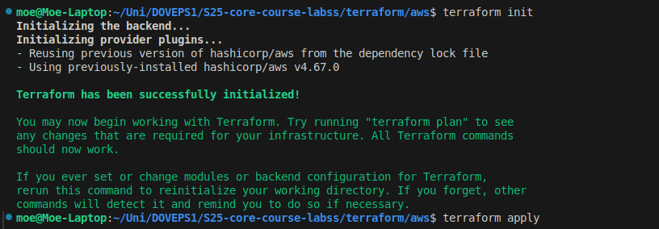
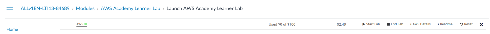
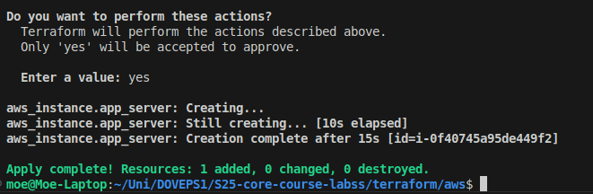
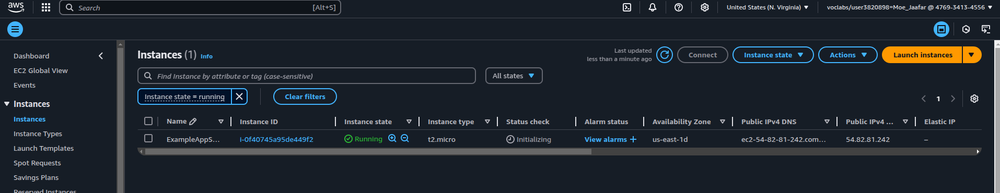

# Terraform State & Outputs

## 🔹 Lab 3: Docker Infrastructure State

### **Docker Resources**

- **Docker Image**: nginx
- **Docker Container**: nginx
- **Container Status**: Running
- **Exposed Port**: 80

### **Terraform State**

```bash
terraform state list
```

- `docker_image.nginx`
- `docker_container.nginx`

---

## 🔹 Lab 4: GitHub Repository State

### **GitHub Repository Details**

- **Default Branch**: master
- **Repository ID**: S25-core-course-labss
- **Repository Name**: S25-core-course-labss
- **Repository URL**: <https://github.com/MoeJaafar/S25-core-course-labss>

---

## 🔹 Lab 4: GitHub Teams (Bonus Task)

### **GitHub Teams Created**

- **Team: Developers** (Push Access)
- **Team: Admins** (Full Control)

### Terraform State

```bash
terraform state list
```

- `github_team.developers`
- `github_team.admins`
- `github_team_membership.dev_member`
- `github_team_membership.admin_member`
- `github_team_repository.developers_repo_access`
- `github_team_repository.admins_repo_access`

---

## AWS Infrastructure with Terraform

## 💼 AWS EC2 Instance Deployment

### **AWS Infrastructure Details**

- **Cloud Provider**: AWS
- **Terraform Provider**: `hashicorp/aws`
- **Region**: `us-east-1`
- **Instance Type**: `t2.micro`
- **AMI ID**: `ami-04b4f1a9cf54c11d0` (Ubuntu Server)
- **Instance Name**: `ExampleAppServerInstance`

### **Terraform Files Used**

- **`main.tf`** → Defines AWS EC2 Instance

```hcl
terraform {
  required_providers {
    aws = {
      source  = "hashicorp/aws"
      version = "~> 4.16"
    }
  }

  required_version = ">= 1.2.0"
}

provider "aws" {
  region = "us-east-1"
}

resource "aws_instance" "app_server" {
  ami           = "ami-04b4f1a9cf54c11d0"
  instance_type = "t2.micro"

  tags = {
    Name = "ExampleAppServerInstance"
  }
}
```

---

## 📊 Terraform State for AWS

### **Terraform State Commands Used**

```bash
terraform init
terraform plan
terraform apply -auto-approve
terraform state list
```

### **Terraform State Output**

```bash
aws_instance.app_server
```

---

## 📈 AWS Terraform Deployment Process

### **1️⃣ Terraform Initialization**

- Initializes Terraform and downloads the required AWS provider.

**Screenshot:** 

**Screenshot:** 

### **2️⃣ Terraform Apply Execution**

- Deploys the EC2 instance on AWS.

**Screenshot:** 

### **3️⃣ AWS EC2 Instance Running**

- Confirms that the instance is successfully running.

**Screenshot:** 

---

## 🔒 **Terraform Best Practices Applied**

### **1️⃣ Infrastructure as Code (IaC)**

✅ Used Terraform to automate EC2 deployment .
✅ Managed infrastructure declaratively.

### **2️⃣ State Management**

✅ Used `terraform state list` to track AWS resources.
✅ Ensured proper **state file management**.

### **3️⃣ Provider & Authentication**

✅ Configured **AWS provider** securely.
✅ Used AWS CLI for authentication (`aws configure`).

### **4️⃣ Code Modularity & Reusability**

✅ Organized Terraform files (`main.tf`).
✅ Used variables instead of hardcoded values (**to be implemented**).

### **5️⃣ Security Best Practices**

✅ Avoided hardcoding AWS credentials (**used CLI auth instead**).
✅ Used instance tags to improve resource identification.
