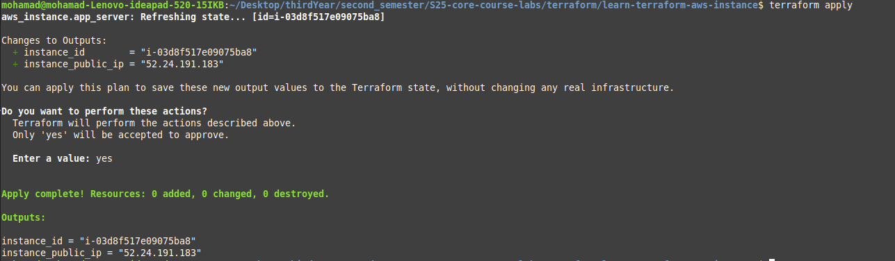
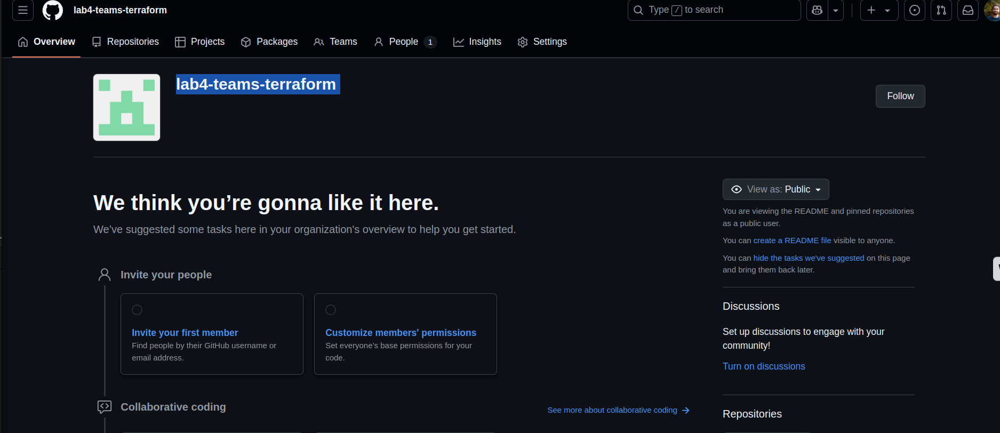

# Terraform Lab Documentation

## Docker Infrastructure Using Terraform

### Introduction-Docker

In this section, I explored Infrastructure as Code (IAC) using Terraform to manage Docker containers. The goal was to create a Docker container running an Nginx server and document the process, including the commands used, the output, and the changes applied.

### Steps-Docker

1. **Initialization**:

   - I initialized the Terraform workspace using the `terraform init` command. This command downloads the necessary provider plugins and sets up the working directory.
   - Screenshot:  
     

2. **Formatting**:

   - I formatted the Terraform configuration files using the `terraform fmt` command to ensure consistent styling.
   - Screenshot:  
     

3. **Validation**:

   - I validated the configuration files using the `terraform validate` command to ensure there were no syntax errors.
   - Screenshot:  
     

4. **Building the Infrastructure**:

   - I applied the Terraform configuration using the `terraform apply` command. This created the Docker image and container as defined in the configuration files.
   - Screenshot of the plan and apply process:  
       
     

   - Log of applied changes:

     ```log
     docker_image.nginx: Refreshing state... [id=sha256:9bea9f2796e236cb18c2b3ad561ff29f655d1001f9ec7247a0bc5e08d25652a1nginx:latest]
     docker_container.nginx: Refreshing state... [id=088ad7cf1a8d72b988abe300160e0149b712c16605bdd82e504b9a37b614a295]

     Terraform used the selected providers to generate the following execution plan. Resource actions are indicated with the following symbols:
     -/+ destroy and then create replacement

     Terraform will perform the following actions:
       # docker_container.nginx must be replaced
     -/+ resource "docker_container" "nginx" {
           + bridge                                      = (known after apply)
           ~ command                                     = [
               - "nginx",
               - "-g",
               - "daemon off;",
             ] -> (known after apply)
           + container_logs                              = (known after apply)
           - cpu_shares                                  = 0 -> null
           - dns                                         = [] -> null
           - dns_opts                                    = [] -> null
           - dns_search                                  = [] -> null
           ~ entrypoint                                  = [
               - "/docker-entrypoint.sh",
             ] -> (known after apply)
           ~ env                                         = [] -> (known after apply)
           + exit_code                                   = (known after apply)
           - group_add                                   = [] -> null
           ~ hostname                                    = "088ad7cf1a8d" -> (known after apply)
           ~ id                                          = "088ad7cf1a8d72b988abe300160e0149b712c16605bdd82e504b9a37b614a295" -> (known after apply)
           ~ init                                        = false -> (known after apply)
           ~ ipc_mode                                    = "private" -> (known after apply)
           ~ log_driver                                  = "json-file" -> (known after apply)
           - log_opts                                    = {} -> null
           - max_retry_count                             = 0 -> null
           - memory                                      = 0 -> null
           - memory_swap                                 = 0 -> null
             name                                        = "tutorial"
           ~ network_data                                = [
               - {
                   - gateway                   = "172.17.0.1"
                   - global_ipv6_prefix_length = 0
                   - ip_address                = "172.17.0.2"
                   - ip_prefix_length          = 16
                   - mac_address               = "02:42:ac:11:00:02"
                   - network_name              = "bridge"
                     # (2 unchanged attributes hidden)
                 },
             ] -> (known after apply)
           - network_mode                                = "bridge" -> null # forces replacement
           - privileged                                  = false -> null
           - publish_all_ports                           = false -> null
           ~ runtime                                     = "runc" -> (known after apply)
           ~ security_opts                               = [] -> (known after apply)
           ~ shm_size                                    = 64 -> (known after apply)
           ~ stop_signal                                 = "SIGQUIT" -> (known after apply)
           ~ stop_timeout                                = 0 -> (known after apply)
           - storage_opts                                = {} -> null
           - sysctls                                     = {} -> null
           - tmpfs                                       = {} -> null
             # (20 unchanged attributes hidden)

           ~ healthcheck (known after apply)

           ~ labels (known after apply)

             # (1 unchanged block hidden)
         }

     Plan: 1 to add, 0 to change, 1 to destroy.

     Do you want to perform these actions?
       Terraform will perform the actions described above.
       Only 'yes' will be accepted to approve.

       Enter a value: yes

     docker_container.nginx: Destroying... [id=088ad7cf1a8d72b988abe300160e0149b712c16605bdd82e504b9a37b614a295]
     docker_container.nginx: Destruction complete after 1s
     docker_container.nginx: Creating...
     docker_container.nginx: Creation complete after 0s [id=d6f31d1a1bb2be0131cb7ac8f0049552a7cc2ede7c89bc09ef3ac62ee58b4842]

     Apply complete! Resources: 1 added, 0 changed, 1 destroyed.
     ```

5. **Running Docker**:

   - After applying the Terraform configuration, I verified that the Docker container was running using the `docker ps` command.
   - Screenshot:  
     

     

6. **Terraform State Commands**:

   - I used the `terraform state list` command to list all resources managed by Terraform.

     - Output:

       ```log
       docker_container.nginx
       docker_image.nginx
       ```

     - Screenshot:  
       

   - I used the `terraform state show docker_container.nginx` command to inspect the state of the Docker container resource.

     - Screenshot:  
       

   - I used the `terraform state show docker_image.nginx` command to inspect the state of the Docker image resource.
     - Screenshot:  
       

7. **Updating Variables**:

   - I updated the `container_name` variable in the `variables.tf` file to rename the Docker container.

8. **Terraform Output**:
   - Finally, I used the `terraform output` command to display the outputs defined in the `outputs.tf` file.
     - Output:

       ```log
       container_id = "4f14041923090376f2834f94565ebc7a1adfc4594a18fd4de55ef09304269426"
       image_id = "sha256:9bea9f2796e236cb18c2b3ad561ff29f655d1001f9ec7247a0bc5e08d25652a1nginx:latest"
       ```

---

## AWS Infrastructure Using Terraform

### Introduction-AWS

In this section, I explored Infrastructure as Code (IAC) using Terraform to manage AWS resources. The goal was to create an EC2 instance on AWS and document the process, including the commands used, their outputs, and the changes applied.

### Steps-AWS

1. **AWS Account Setup**:

   - I created an AWS account and generated access credentials (access key and secret key) to enable Terraform to interact with AWS services.
   - Screenshots:  
       
     

2. **AWS CLI Configuration**:

   - I configured the AWS CLI using the `aws configure` command to set up the access key, secret key, default region, and output format.
   - Screenshot:  
     

3. **Terraform Configuration**:

   - I created the necessary Terraform configuration files (`main.tf`, `resources.tf`) to define the AWS provider and EC2 instance.
   - I initialized the Terraform workspace using the `terraform init` command to download the AWS provider plugin.
   - Screenshot:  
     

4. **Formatting and Validation**:

   - I formatted the Terraform configuration files using the `terraform fmt` command to ensure consistent styling.
   - I validated the configuration files using the `terraform validate` command to ensure there were no syntax errors.
   - Screenshot:  
     

5. **Applying the Configuration**:

   - I applied the Terraform configuration using the `terraform apply` command. This created the EC2 instance as defined in the configuration files.
   - Log of applied changes:

     ```log
     Terraform used the selected providers to generate the following execution plan. Resource actions are indicated with the
     following symbols:
       + create

     Terraform will perform the following actions:

       # aws_instance.app_server will be created
       + resource "aws_instance" "app_server" {
           + ami                                  = "ami-830c94e3"
           + arn                                  = (known after apply)
           + associate_public_ip_address          = (known after apply)
           + availability_zone                    = (known after apply)
           + cpu_core_count                       = (known after apply)
           + cpu_threads_per_core                 = (known after apply)
           + disable_api_stop                     = (known after apply)
           + disable_api_termination              = (known after apply)
           + ebs_optimized                        = (known after apply)
           + get_password_data                    = false
           + host_id                              = (known after apply)
           + host_resource_group_arn              = (known after apply)
           + iam_instance_profile                 = (known after apply)
           + id                                   = (known after apply)
           + instance_initiated_shutdown_behavior = (known after apply)
           + instance_state                       = (known after apply)
           + instance_type                        = "t2.micro"
           + ipv6_address_count                   = (known after apply)
           + ipv6_addresses                       = (known after apply)
           + key_name                             = (known after apply)
           + monitoring                           = (known after apply)
           + outpost_arn                          = (known after apply)
           + password_data                        = (known after apply)
           + placement_group                      = (known after apply)
           + placement_partition_number           = (known after apply)
           + primary_network_interface_id         = (known after apply)
           + private_dns                          = (known after apply)
           + private_ip                           = (known after apply)
           + public_dns                           = (known after apply)
           + public_ip                            = (known after apply)
           + secondary_private_ips                = (known after apply)
           + security_groups                      = (known after apply)
           + source_dest_check                    = true
           + subnet_id                            = (known after apply)
           + tags                                 = {
               + "Name" = "ExampleAppServerInstance"
             }
           + tags_all                             = {
               + "Name" = "ExampleAppServerInstance"
             }
           + tenancy                              = (known after apply)
           + user_data                            = (known after apply)
           + user_data_base64                     = (known after apply)
           + user_data_replace_on_change          = false
           + vpc_security_group_ids               = (known after apply)

           + capacity_reservation_specification (known after apply)

           + cpu_options (known after apply)

           + ebs_block_device (known after apply)

           + enclave_options (known after apply)

           + ephemeral_block_device (known after apply)

           + maintenance_options (known after apply)

           + metadata_options (known after apply)

           + network_interface (known after apply)

           + private_dns_name_options (known after apply)

           + root_block_device (known after apply)
         }

     Plan: 1 to add, 0 to change, 0 to destroy.

     Do you want to perform these actions?
       Terraform will perform the actions described above.
       Only 'yes' will be accepted to approve.

       Enter a value: yes

     aws_instance.app_server: Creating...
     aws_instance.app_server: Still creating... [10s elapsed]
     aws_instance.app_server: Creation complete after 17s [id=i-01bf4dc69f773b094]
     ```

   - Screenshots:  
       
     

6. **Verifying the EC2 Instance**:

   - I verified the creation of the EC2 instance by checking the AWS Management Console.
   - Screenshot:  
     

7. **Inspecting Terraform State**:

   - I used the `terraform state list` command to list all resources managed by Terraform.

     - Output:

       ```log
       aws_instance.app_server
       ```

     - Screenshot:  
       

   - I used the `terraform state show aws_instance.app_server` command to inspect the state of the EC2 instance resource.
     - Screenshot:  
         
       

8. **Updating the AMI**:

   - I manually updated the AMI of the EC2 instance from the AWS Management Console and reapplied the Terraform configuration to reflect the changes.
   - Screenshots:  
       
       
       
     

9. **Using Variables to Override Instance Name**

   - I used input variables to override the instance name dynamically.
   - Screenshot:  
     

10. **Adding Outputs**

- Finally, I added output variables in the Terraform configuration to display the instance’s public IP and other useful information after applying the configuration.
- Screenshot:
  
  

---

## GitHub Infrastructure Using Terraform

### Introduction-GitHub

In this section, I explored Infrastructure as Code (IAC) using Terraform to manage GitHub repositories. The goal was to create and manage a GitHub repository, set branch protection rules, and document the process, including the commands used, their outputs, and the changes applied.

### Steps-GitHub

1. **Installing GitHub CLI**:

   - I installed the GitHub CLI (`gh`) to interact with GitHub from the command line.
   - Screenshot:  
     

2. **Terraform Initialization**:

   - I initialized the Terraform workspace using the `terraform init` command to download the GitHub provider plugin.
   - Screenshot:  
     

3. **Applying the Terraform Configuration**:

   - I applied the Terraform configuration using the `terraform apply` command. This created a new GitHub repository and set up branch protection rules.
   - Screenshots:  
     
     

4. **Importing an Existing Repository**:

   - I used the `terraform import` command to import an existing GitHub repository into the Terraform state.
   - State of the imported repository:

     ```hcl
     # github_repository.S25-core-course-labs:
     resource "github_repository" "S25-core-course-labs" {
         allow_auto_merge            = false
         allow_merge_commit          = true
         allow_rebase_merge          = true
         allow_squash_merge          = true
         allow_update_branch         = false
         archived                    = false
         auto_init                   = false
         default_branch              = "master"
         delete_branch_on_merge      = false
         description                 = null
         etag                        = "W/\"aeaaf6e06431167cd7b304909dcb05fa458101fa344c524fd9bae992bf65a16f\""
         full_name                   = "Ali12hamdan/S25-core-course-labs"
         git_clone_url               = "git://github.com/Ali12hamdan/S25-core-course-labs.git"
         has_discussions             = false
         has_downloads               = true
         has_issues                  = false
         has_projects                = true
         has_wiki                    = true
         homepage_url                = null
         html_url                    = "https://github.com/Ali12hamdan/S25-core-course-labs"
         http_clone_url              = "https://github.com/Ali12hamdan/S25-core-course-labs.git"
         id                          = "S25-core-course-labs"
         is_template                 = false
         merge_commit_message        = "PR_TITLE"
         merge_commit_title          = "MERGE_MESSAGE"
         name                        = "S25-core-course-labs"
         node_id                     = "R_kgDONunwMQ"
         primary_language            = null
         private                     = false
         repo_id                     = 921301041
         squash_merge_commit_message = "COMMIT_MESSAGES"
         squash_merge_commit_title   = "COMMIT_OR_PR_TITLE"
         ssh_clone_url               = "git@github.com:Ali12hamdan/S25-core-course-labs.git"
         svn_url                     = "https://github.com/Ali12hamdan/S25-core-course-labs"
         topics                      = []
         visibility                  = "public"
         vulnerability_alerts        = false
         web_commit_signoff_required = false

         security_and_analysis {
             secret_scanning {
                 status = "enabled"
             }
             secret_scanning_push_protection {
                 status = "enabled"
             }
         }
     }
     ```

   - Screenshot:  
     

5. **Updating Repository Description and Branch Protection**:

   - I updated the repository description and added branch protection rules for the `master` branch.
   - Log of applied changes:

     ```log
     github_repository.S25-core-course-labs: Refreshing state... [id=S25-core-course-labs]
     github_repository.repo: Refreshing state... [id=learn-terraform-github-lab4]
     github_branch_default.main: Refreshing state... [id=learn-terraform-github-lab4]
     github_branch_protection.default: Refreshing state... [id=BPR_kwDONz3Pg84DiL8D]

     Terraform used the selected providers to generate the following execution plan. Resource actions are indicated with the following symbols:
       + create
       ~ update in-place

     Terraform will perform the following actions:

       # github_branch_protection.S25-core-course-labs will be created
       + resource "github_branch_protection" "S25-core-course-labs" {
           + allows_deletions                = false
           + allows_force_pushes             = false
           + enforce_admins                  = true
           + id                              = (known after apply)
           + lock_branch                     = false
           + pattern                         = "master"
           + repository_id                   = "S25-core-course-labs"
           + require_conversation_resolution = true
           + require_signed_commits          = false
           + required_linear_history         = false

           + required_pull_request_reviews {
               + require_last_push_approval      = false
               + required_approving_review_count = 1
             }
         }

       # github_repository.S25-core-course-labs will be updated in-place
       ~ resource "github_repository" "S25-core-course-labs" {
           + description                 = "This repository contains course materials and exercises for learning DevOps practices. It covers topics such as continuous integration, continuous deployment, infrastructure as code, containerization, and monitoring. The course is designed to provide hands-on experience with tools like GitHub Actions, Docker, Terraform, and Kubernetes."
           - has_downloads               = true -> null
           - has_projects                = true -> null
           - has_wiki                    = true -> null
             id                          = "S25-core-course-labs"
             name                        = "S25-core-course-labs"
             # (32 unchanged attributes hidden)

             # (1 unchanged block hidden)
         }

     Plan: 1 to add, 1 to change, 0 to destroy.

     Do you want to perform these actions?
       Terraform will perform the actions described above.
       Only 'yes' will be accepted to approve.

       Enter a value: yes

     github_repository.S25-core-course-labs: Modifying... [id=S25-core-course-labs]
     github_repository.S25-core-course-labs: Modifications complete after 2s [id=S25-core-course-labs]
     github_branch_protection.S25-core-course-labs: Creating...
     github_branch_protection.S25-core-course-labs: Creation complete after 4s [id=BPR_kwDONunwMc4DiRKK]

     Apply complete! Resources: 1 added, 1 changed, 0 destroyed.
     ```

   - Screenshot:  
     

---

## Bonus Task: GitHub Teams Using Terraform

### Introduction-GitHub-Teams

In this bonus task, I extended the Terraform configuration to manage GitHub teams within an organization. The goal was to create teams, assign members, and set repository permissions for each team. This task demonstrates how Terraform can be used to manage GitHub organization resources efficiently.

### Steps-GitHub-Teams

1. **Creating a GitHub Organization**:

   - I created a new GitHub organization named `lab4-teams-terraform` to manage teams and repositories.
   - Screenshot:  
     

2. **Generating an Access Token**:

   - I generated a GitHub access token with the necessary permissions (`repo`, `admin:org`, `delete_repo`) to allow Terraform to manage the organization's resources.
   - The token was stored securely and used as an environment variable to avoid hardcoding it in the configuration.

3. **Terraform Initialization**:

   - I initialized the Terraform workspace using the `terraform init` command to download the GitHub provider plugin.
   - Screenshot:  
     

4. **Creating Teams**:

   - I applied the Terraform configuration to create two teams: `Backend Team` and `Frontend Team`.
   - Since teams need to be created before assigning members or repository permissions, I used the `-target` flag to apply only the team resources initially.
   - Log of applied changes:

     ```log
     Terraform used the selected providers to generate the following execution plan. Resource actions are indicated with the following symbols:
       + create

     Terraform will perform the following actions:

       # github_team.all["Backend Team"] will be created
       + resource "github_team" "all" {
           + create_default_maintainer = true
           + description               = "Backend Team"
           + etag                      = (known after apply)
           + id                        = (known after apply)
           + members_count             = (known after apply)
           + name                      = "Backend Team"
           + node_id                   = (known after apply)
           + parent_team_read_id       = (known after apply)
           + parent_team_read_slug     = (known after apply)
           + privacy                   = "closed"
           + slug                      = (known after apply)
         }

       # github_team.all["Frontend Team"] will be created
       + resource "github_team" "all" {
           + create_default_maintainer = true
           + description               = "Frontend Team"
           + etag                      = (known after apply)
           + id                        = (known after apply)
           + members_count             = (known after apply)
           + name                      = "Frontend Team"
           + node_id                   = (known after apply)
           + parent_team_read_id       = (known after apply)
           + parent_team_read_slug     = (known after apply)
           + privacy                   = "closed"
           + slug                      = (known after apply)
         }

     Plan: 2 to add, 0 to change, 0 to destroy.

     Do you want to perform these actions?
       Terraform will perform the actions described above.
       Only 'yes' will be accepted to approve.

       Enter a value: yes

     github_team.all["Backend Team"]: Creating...
     github_team.all["Frontend Team"]: Creating...
     github_team.all["Backend Team"]: Creation complete after 3s [id=12106517]
     github_team.all["Frontend Team"]: Creation complete after 3s [id=12106518]
     ```

   - Screenshot:  
     

5. **Applying the Full Configuration**:

   - After creating the teams, I applied the full Terraform configuration to create repositories, assign members to teams, and set repository permissions.
   - Log of applied changes:

     ```log
     github_team.all["Backend Team"]: Refreshing state... [id=12106517]
     github_team.all["Frontend Team"]: Refreshing state... [id=12106518]

     Terraform used the selected providers to generate the following execution plan. Resource actions are indicated with the following symbols:
       + create

     Terraform will perform the following actions:

       # github_membership.all["Ahmad-mtos"] will be created
       + resource "github_membership" "all" {
           + downgrade_on_destroy = false
           + etag                 = (known after apply)
           + id                   = (known after apply)
           + role                 = "member"
           + username             = "Ahmad-mtos"
         }

       # github_membership.all["thecarrot123"] will be created
       + resource "github_membership" "all" {
           + downgrade_on_destroy = false
           + etag                 = (known after apply)
           + id                   = (known after apply)
           + role                 = "member"
           + username             = "thecarrot123"
         }

       # github_repository.application will be created
       + resource "github_repository" "application" {
           + allow_auto_merge            = false
           + allow_merge_commit          = true
           + allow_rebase_merge          = true
           + allow_squash_merge          = true
           + archived                    = false
           + default_branch              = (known after apply)
           + delete_branch_on_merge      = false
           + etag                        = (known after apply)
           + full_name                   = (known after apply)
           + git_clone_url               = (known after apply)
           + html_url                    = (known after apply)
           + http_clone_url              = (known after apply)
           + id                          = (known after apply)
           + merge_commit_message        = "PR_TITLE"
           + merge_commit_title          = "MERGE_MESSAGE"
           + name                        = "learn-terraform-github-organization-application"
           + node_id                     = (known after apply)
           + primary_language            = (known after apply)
           + private                     = (known after apply)
           + repo_id                     = (known after apply)
           + squash_merge_commit_message = "COMMIT_MESSAGES"
           + squash_merge_commit_title   = "COMMIT_OR_PR_TITLE"
           + ssh_clone_url               = (known after apply)
           + svn_url                     = (known after apply)
           + topics                      = (known after apply)
           + visibility                  = (known after apply)
           + web_commit_signoff_required = false

           + security_and_analysis (known after apply)
         }

       # github_repository.infrastructure will be created
       + resource "github_repository" "infrastructure" {
           + allow_auto_merge            = false
           + allow_merge_commit          = true
           + allow_rebase_merge          = true
           + allow_squash_merge          = true
           + archived                    = false
           + default_branch              = (known after apply)
           + delete_branch_on_merge      = false
           + etag                        = (known after apply)
           + full_name                   = (known after apply)
           + git_clone_url               = (known after apply)
           + html_url                    = (known after apply)
           + http_clone_url              = (known after apply)
           + id                          = (known after apply)
           + merge_commit_message        = "PR_TITLE"
           + merge_commit_title          = "MERGE_MESSAGE"
           + name                        = "learn-terraform-github-organization-infrastructure"
           + node_id                     = (known after apply)
           + primary_language            = (known after apply)
           + private                     = (known after apply)
           + repo_id                     = (known after apply)
           + squash_merge_commit_message = "COMMIT_MESSAGES"
           + squash_merge_commit_title   = "COMMIT_OR_PR_TITLE"
           + ssh_clone_url               = (known after apply)
           + svn_url                     = (known after apply)
           + topics                      = (known after apply)
           + visibility                  = (known after apply)
           + web_commit_signoff_required = false

           + security_and_analysis (known after apply)
         }

       # github_team_membership.members["backend-team-thecarrot123"] will be created
       + resource "github_team_membership" "members" {
           + etag     = (known after apply)
           + id       = (known after apply)
           + role     = "member"
           + team_id  = "12106517"
           + username = "thecarrot123"
         }

       # github_team_membership.members["frontend-team-Ahmad-mtos"] will be created
       + resource "github_team_membership" "members" {
           + etag     = (known after apply)
           + id       = (known after apply)
           + role     = "member"
           + team_id  = "12106518"
           + username = "Ahmad-mtos"
         }

       # github_team_repository.application["Backend Team"] will be created
       + resource "github_team_repository" "application" {
           + etag       = (known after apply)
           + id         = (known after apply)
           + permission = "push"
           + repository = (known after apply)
           + team_id    = "12106517"
         }

       # github_team_repository.application["Frontend Team"] will be created
       + resource "github_team_repository" "application" {
           + etag       = (known after apply)
           + id         = (known after apply)
           + permission = "maintain"
           + repository = (known after apply)
           + team_id    = "12106518"
         }

       # github_team_repository.infrastructure["Backend Team"] will be created
       + resource "github_team_repository" "infrastructure" {
           + etag       = (known after apply)
           + id         = (known after apply)
           + permission = "pull"
           + repository = (known after apply)
           + team_id    = "12106517"
         }

       # github_team_repository.infrastructure["Frontend Team"] will be created
       + resource "github_team_repository" "infrastructure" {
           + etag       = (known after apply)
           + id         = (known after apply)
           + permission = "maintain"
           + repository = (known after apply)
           + team_id    = "12106518"
         }

     Plan: 10 to add, 0 to change, 0 to destroy.

     Do you want to perform these actions?
       Terraform will perform the actions described above.
       Only 'yes' will be accepted to approve.

       Enter a value: yes

     github_team_membership.members["backend-team-thecarrot123"]: Creating...
     github_membership.all["thecarrot123"]: Creating...
     github_membership.all["Ahmad-mtos"]: Creating...
     github_team_membership.members["frontend-team-Ahmad-mtos"]: Creating...
     github_repository.application: Creating...
     github_repository.infrastructure: Creating...
     github_team_membership.members["backend-team-thecarrot123"]: Creation complete after 9s [id=12106517:thecarrot123]
     github_membership.all["Ahmad-mtos"]: Creation complete after 10s [id=lab4-teams-terraform:Ahmad-mtos]
     github_membership.all["thecarrot123"]: Still creating... [10s elapsed]
     github_team_membership.members["frontend-team-Ahmad-mtos"]: Still creating... [10s elapsed]
     github_repository.application: Still creating... [10s elapsed]
     github_repository.infrastructure: Still creating... [10s elapsed]
     github_membership.all["thecarrot123"]: Creation complete after 10s [id=lab4-teams-terraform:thecarrot123]
     github_team_membership.members["frontend-team-Ahmad-mtos"]: Creation complete after 10s [id=12106518:Ahmad-mtos]
     github_repository.application: Creation complete after 14s [id=learn-terraform-github-organization-application]
     github_team_repository.application["Backend Team"]: Creating...
     github_team_repository.application["Frontend Team"]: Creating...
     github_repository.infrastructure: Creation complete after 14s [id=learn-terraform-github-organization-infrastructure]
     github_team_repository.infrastructure["Backend Team"]: Creating...
     github_team_repository.infrastructure["Frontend Team"]: Creating...
     github_team_repository.application["Frontend Team"]: Creation complete after 6s [id=12106518:learn-terraform-github-organization-application]
     github_team_repository.application["Backend Team"]: Creation complete after 7s [id=12106517:learn-terraform-github-organization-application]
     github_team_repository.infrastructure["Frontend Team"]: Creation complete after 7s [id=12106518:learn-terraform-github-organization-infrastructure]
     github_team_repository.infrastructure["Backend Team"]: Creation complete after 7s [id=12106517:learn-terraform-github-organization-infrastructure]

     Apply complete! Resources: 10 added, 0 changed, 0 destroyed.
     ```

6. **Verifying Resources on GitHub**:
   - I verified the created resources on the GitHub organization dashboard:
     - **Repositories**:  
       
     - **Teams**:  
       
     - **People**:  
       

---

## Terraform Best Practices

### 1. **Modularize My Code**

I try to break my Terraform code into small, reusable modules. This keeps my configurations clean and easier to maintain.

### 2. **Use Version Control**

I always commit my Terraform files to Git and make sure I exclude sensitive files like `.tfvars` or `.terraform` using `.gitignore`.

### 3. **Manage Sensitive Data**

Instead of hard-coding sensitive information, I use variables and environment variables to manage things like tokens or passwords securely.

### 4. **Simplify with Locals**

I use `locals` to simplify complex data transformations, like parsing CSV files or creating lists/maps dynamically. It keeps my code cleaner.

### 5. **Make Code Idempotent**

I make sure my Terraform code is idempotent, meaning I can apply it multiple times without causing unwanted changes.

### 6. **Use Outputs**

I create output blocks to expose key information, like URLs or IDs, so I can easily reference them later or pass them to other modules.

### 7. **Follow Naming Conventions**

I stick to clear, consistent naming conventions for resources, variables, and outputs to make my code easy to read and maintain.

### 8. **Plan Before Applying**

Before applying any changes, I always run `terraform plan` to check what will be modified. Only when I'm confident, I run `terraform apply`.

### 9. **Format Code**

I use `terraform fmt` to automatically format my Terraform files. This ensures my code is consistent, readable, and adheres to the Terraform style guide.

### 10. **Validate Configuration**

I always run `terraform validate` to check that my configuration files are syntactically valid before applying any changes. This helps me catch errors early.
