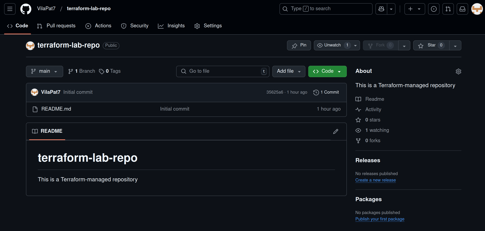

# Terraform Setup and Docker Infrastructure

## Display the State of a Specific Resource 

**Docker container**
```bash
terraform state show docker_container.nginx                   

# docker_container.nginx:
resource "docker_container" "nginx" {
    attach                                      = false
    bridge                                      = null
    command                                     = [
        "nginx",
        "-g",
        "daemon off;",
    ]
    container_read_refresh_timeout_milliseconds = 15000
    cpu_set                                     = null
    cpu_shares                                  = 0
    domainname                                  = null
    entrypoint                                  = [
        "/docker-entrypoint.sh",
    ]
    env                                         = []
    hostname                                    = "2f8379ae4c4c"
    id                                          = "2f8379ae4c4ccf305edf3d952197b7698fa9d50c347a948508a8d6f64d8a67ac"
    image                                       = "sha256:9bea9f2796e236cb18c2b3ad561ff29f655d1001f9ec7247a0bc5e08d25652a1"
    init                                        = false
    ipc_mode                                    = "private"
    log_driver                                  = "json-file"
    logs                                        = false
    max_retry_count                             = 0
    memory                                      = 0
    memory_swap                                 = 0
    must_run                                    = true
    name                                        = "nginx_container"
    network_data                                = [
        {
            gateway                   = "172.17.0.1"
            global_ipv6_address       = null
            global_ipv6_prefix_length = 0
            ip_address                = "172.17.0.2"
            ip_prefix_length          = 16
            ipv6_gateway              = null
            mac_address               = "02:42:ac:11:00:02"
            network_name              = "bridge"
        },
    ]
    network_mode                                = "bridge"
    pid_mode                                    = null
    privileged                                  = false
    publish_all_ports                           = false
    read_only                                   = false
    remove_volumes                              = true
    restart                                     = "no"
    rm                                          = false
    runtime                                     = "runc"
    security_opts                               = []
    shm_size                                    = 64
    start                                       = true
    stdin_open                                  = false
    stop_signal                                 = "SIGQUIT"
    stop_timeout                                = 0
    tty                                         = false
    user                                        = null
    userns_mode                                 = null
    wait                                        = false
    wait_timeout                                = 60
    working_dir                                 = null

    ports {
        external = 8080
        internal = 80
        ip       = "0.0.0.0"
        protocol = "tcp"
    }
}
```

**Docker image**
```bash
terraform state show docker_image.nginx                       


# docker_image.nginx:
resource "docker_image" "nginx" {
    id           = "sha256:9bea9f2796e236cb18c2b3ad561ff29f655d1001f9ec7247a0bc5e08d25652a1nginx:latest"
    image_id     = "sha256:9bea9f2796e236cb18c2b3ad561ff29f655d1001f9ec7247a0bc5e08d25652a1"
    keep_locally = false
    name         = "nginx:latest"
    repo_digest  = "nginx@sha256:0a399eb16751829e1af26fea27b20c3ec28d7ab1fb72182879dcae1cca21206a"
}

```

## List All Managed Resources

```bash
terraform state list                                          

docker_container.nginx
docker_image.nginx
```

## Outputs

```bash
terraform output                                              [git:lab4] ✖  

container_id = "510b0fc2e252e64925553e0b81c853fd2d00b566cbfe5225e0e3c04f96b53ee2"
container_name = "my-nginx-container"
image_id = "sha256:9bea9f2796e236cb18c2b3ad561ff29f655d1001f9ec7247a0bc5e08d25652a1"
image_name = "nginx:latest"
```

# Yandex Cloud Infrastructure Using Terraform

## 1. Creating an Account in Yandex Cloud

- Registered on Yandex Cloud and created a cloud (copy cloud id).
- Created a folder within the cloud to manage resources (copy folder id).
- Created a service account with the necessary permissions for Terraform (copy service account id).
  **Necessary permissions:**
  - admin     
  - storage.editor
  - compute.admin
  - editor
  - resource-manager.editor
  - viewer
  - resource-manager.admin

## 2. Setting Up Terraform and Creating Resources

- Created a configuration file main.tf to define the required resources.
- Added variables for easy configuration (e.g., cloud_id, folder_id, token.
- Authenticated in Yandex Cloud using: 

```bash 
yc init
```

- Initialized Terraform with:

```bash
terraform init
```

- Deployed resources using:

```bash
terraform apply
```

## 3. Issues and Solutions

### Issue: yc resource-manager cloud list returned an empty result.
- **Problem**: When checking available clouds, the command yc resource-manager cloud list returned empty table.
- **Solution**: Ran yc init and created a new profile. Re-entered cloud_id, folder_id, token. After this, yc resource-manager cloud list started displaying the correct data.

### Issue: yc resource-manager folder list returned an empty result.
- **Problem**: When checking available clouds, the command yc resource-manager folder list returned empty table.
- **Solution**: Ran yc init and created a new profile. Re-entered cloud_id, folder_id, token. After this, yc resource-manager folder list started displaying the correct data.

## List All Managed Resources

```bash
terraform state list 

yandex_compute_instance.vm
```

## Display the State of a Specific Resource

**Virtual Machine (VM) resource in Yandex Cloud**
```bash
terraform state show yandex_compute_instance.vm              
# yandex_compute_instance.vm:
resource "yandex_compute_instance" "vm" {
    created_at                = "2025-02-04T14:01:19Z"
    description               = null
    folder_id                 = "b1guu2aobu6m1g2af9ou"
    fqdn                      = "fhmvilumeoom7tkaothb.auto.internal"
    gpu_cluster_id            = null
    hardware_generation       = [
        {
            generation2_features = []
            legacy_features      = [
                {
                    pci_topology = "PCI_TOPOLOGY_V1"
                },
            ]
        },
    ]
    hostname                  = null
    id                        = "fhmvilumeoom7tkaothb"
    maintenance_grace_period  = null
    name                      = "yc-vm"
    network_acceleration_type = "standard"
    platform_id               = "standard-v1"
    service_account_id        = null
    status                    = "running"
    zone                      = "ru-central1-a"

    boot_disk {
        auto_delete = true
        device_name = "fhm8smgvlnhnup8psu0t"
        disk_id     = "fhm8smgvlnhnup8psu0t"
        mode        = "READ_WRITE"

        initialize_params {
            block_size  = 4096
            description = null
            image_id    = "fd86jl8gechvgkabt374"
            kms_key_id  = null
            name        = null
            size        = 5
            snapshot_id = null
            type        = "network-hdd"
        }
    }

    metadata_options {
        aws_v1_http_endpoint = 1
        aws_v1_http_token    = 2
        gce_http_endpoint    = 1
        gce_http_token       = 1
    }

    network_interface {
        index              = 0
        ip_address         = "10.128.0.18"
        ipv4               = true
        ipv6               = false
        ipv6_address       = null
        mac_address        = "d0:0d:1f:95:7d:67"
        nat                = true
        nat_ip_address     = "89.169.139.172"
        nat_ip_version     = "IPV4"
        security_group_ids = []
        subnet_id          = "e9bftvjtppp5p6pnu9oc"
    }

    placement_policy {
        host_affinity_rules       = []
        placement_group_id        = null
        placement_group_partition = 0
    }

    resources {
        core_fraction = 100
        cores         = 2
        gpus          = 0
        memory        = 2
    }

    scheduling_policy {
        preemptible = false
    }
}
```

## Best Practices in Terraform for GitHub

1. **Use variables** - Store tokens in environment variables or `terraform.tfvars`, not in code.
2. **Importing existing resources** - Use `terraform import` to avoid creating duplicates.
3. **Branch Protection Rules** - Protect the main branch, preventing accidental changes.
4. **Restricted Access Rights** - When issuing a GitHub token, give the minimum necessary permissions.
   **Necessary permissions:**
   - repo
   - read:org
   - admin:repo-hook
   - read:discussion 
5. **State Management** - Use `terraform state` to manage the infrastructure to avoid unsynchronization.

### Import Existing Repository:

```bash 
terraform import github_repository.existing_repo S25-core-course-labs

github_repository.existing_repo: Importing from ID "S25-core-course-labs"...
github_repository.existing_repo: Import prepared!
  Prepared github_repository for import
github_repository.existing_repo: Refreshing state... [id=S25-core-course-labs]

Import successful!

The resources that were imported are shown above. These resources are now in
your Terraform state and will henceforth be managed by Terraform.
```

## List All Managed Resources

```bash
terraform state list

github_branch_protection.main
github_repository.existing_repo
github_repository.my_repo
```

## Display the State of a Specific Resource

**Imported repository**
```bash
terraform state show github_repository.existing_repo         

# github_repository.existing_repo:
resource "github_repository" "existing_repo" {
    allow_auto_merge            = false
    allow_merge_commit          = true
    allow_rebase_merge          = true
    allow_squash_merge          = true
    allow_update_branch         = false
    archived                    = false
    auto_init                   = false
    default_branch              = "master"
    delete_branch_on_merge      = false
    description                 = "Existing repository managed by Terraform"
    etag                        = "W/\"f973237cc1d54534da70f917a4ee2c6fc9319b216296228d8c553038c0e28241\""
    full_name                   = "VilaPat7/S25-core-course-labs"
    git_clone_url               = "git://github.com/VilaPat7/S25-core-course-labs.git"
    has_discussions             = false
    has_downloads               = false
    has_issues                  = false
    has_projects                = false
    has_wiki                    = false
    homepage_url                = null
    html_url                    = "https://github.com/VilaPat7/S25-core-course-labs"
    http_clone_url              = "https://github.com/VilaPat7/S25-core-course-labs.git"
    id                          = "S25-core-course-labs"
    is_template                 = false
    merge_commit_message        = "PR_TITLE"
    merge_commit_title          = "MERGE_MESSAGE"
    name                        = "S25-core-course-labs"
    node_id                     = "R_kgDONwNwcw"
    primary_language            = null
    private                     = false
    repo_id                     = 922972275
    squash_merge_commit_message = "COMMIT_MESSAGES"
    squash_merge_commit_title   = "COMMIT_OR_PR_TITLE"
    ssh_clone_url               = "git@github.com:VilaPat7/S25-core-course-labs.git"
    svn_url                     = "https://github.com/VilaPat7/S25-core-course-labs"
    topics                      = []
    visibility                  = "public"
    vulnerability_alerts        = false
    web_commit_signoff_required = false

    security_and_analysis {
        secret_scanning {
            status = "enabled"
        }
        secret_scanning_push_protection {
            status = "enabled"
        }
    }
}
```

## terraform-lab-repo:

