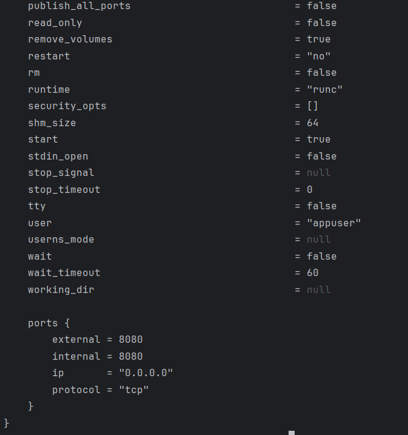
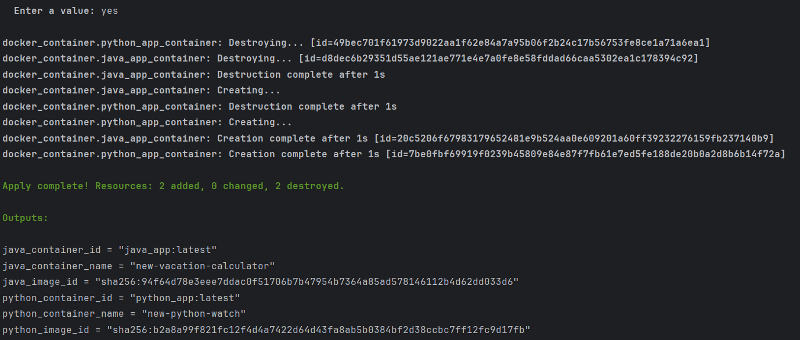

# Terraform

---

This is my first time when I really used terraform in practice, so there can be any inconveniences in configuration.
Please give your advices to me how to better implement such tools because I want to see myself as a devops in the future
(as on of the possible ways).

---

## `terraform state list`


---

## 'terraform state show <state_list_entry_i>'

* `java_app_container`




---

* `python_app_container`


---

* `docker_image.java_app_image`


---

* `docker_image.python_app_image`


---

## Changing names of the containers




---

## `terraform output`


---

## Usage of Yandex.Cloud Provider

Firstly, It was hard for me to understand, what is exactly 'free-tier' means. Then, after some research, it is become
clear that this is free start grant when user fisrtly create billing plan. Therefore, this one is the most difficult
part
for me.

Then I faced the next error:


It was connected to the absence of `terraform.rc` file. After I created it, no difficulties at all.

## `terraform plan`

```bash
yandex_vpc_network.devops-net: Refreshing state... [id=enpmqu5qfo2nfb46lqsu]
yandex_vpc_subnet.devops-subnet: Refreshing state... [id=e2lt0266hkmjaa0kof7e]

Terraform used the selected providers to generate the following execution plan. Resource actions are indicated with the following symbols:
  + create

Terraform will perform the following actions:

  # yandex_compute_disk.vm-disk will be created
  + resource "yandex_compute_disk" "vm-disk" {
      + block_size  = 4096
      + created_at  = (known after apply)
      + folder_id   = (known after apply)
      + id          = (known after apply)
      + image_id    = "fd8bpal18cm4kprpjc2m"
      + name        = "ubuntu-2404-lts-oslogin-v20250203"
      + product_ids = (known after apply)
      + size        = 10
      + status      = (known after apply)
      + type        = "network-ssd"
      + zone        = "ru-central1-b"

      + disk_placement_policy (known after apply)

      + hardware_generation (known after apply)
    }

  # yandex_compute_instance.vm will be created
  + resource "yandex_compute_instance" "vm" {
      + created_at                = (known after apply)
      + folder_id                 = (known after apply)
      + fqdn                      = (known after apply)
      + gpu_cluster_id            = (known after apply)
      + hardware_generation       = (known after apply)
      + hostname                  = (known after apply)
      + id                        = (known after apply)
      + maintenance_grace_period  = (known after apply)
      + maintenance_policy        = (known after apply)
      + metadata                  = {
          + "ssh-keys" = (sensitive value)
        }
      + name                      = "devops-vm"
      + network_acceleration_type = "standard"
      + platform_id               = "standard-v1"
      + service_account_id        = (known after apply)
      + status                    = (known after apply)
      + zone                      = "ru-central1-b"

      + boot_disk {
          + auto_delete = true
          + device_name = (known after apply)
          + disk_id     = (known after apply)
          + mode        = (known after apply)

          + initialize_params (known after apply)
        }

      + metadata_options (known after apply)

      + network_interface {
          + index              = 1
          + ip_address         = (known after apply)
          + ipv4               = true
          + ipv6               = (known after apply)
          + ipv6_address       = (known after apply)
          + mac_address        = (known after apply)
          + nat                = true
          + nat_ip_address     = (known after apply)
          + nat_ip_version     = (known after apply)
          + security_group_ids = (known after apply)
          + subnet_id          = "e2lt0266hkmjaa0kof7e"
        }

      + placement_policy (known after apply)

      + resources {
          + core_fraction = 20
          + cores         = 2
          + memory        = 2
        }

      + scheduling_policy {
          + preemptible = true
        }
    }

Plan: 2 to add, 0 to change, 0 to destroy.

Do you want to perform these actions?
  Terraform will perform the actions described above.
  Only 'yes' will be accepted to approve.

  Enter a value: yes

yandex_compute_disk.vm-disk: Creating...
yandex_compute_disk.vm-disk: Creation complete after 7s [id=epdmjld5d1sb15vbpo57]
yandex_compute_instance.vm: Creating...
yandex_compute_instance.vm: Still creating... [10s elapsed]
yandex_compute_instance.vm: Still creating... [20s elapsed]
yandex_compute_instance.vm: Still creating... [30s elapsed]
yandex_compute_instance.vm: Still creating... [40s elapsed]
yandex_compute_instance.vm: Still creating... [50s elapsed]
yandex_compute_instance.vm: Still creating... [1m0s elapsed]
yandex_compute_instance.vm: Still creating... [1m10s elapsed]
yandex_compute_instance.vm: Still creating... [1m20s elapsed]
yandex_compute_instance.vm: Creation complete after 1m22s [id=epdupbocj0edg6nbrk7c]

Apply complete! Resources: 2 added, 0 changed, 0 destroyed.

D:\Studying\S25-core-course-labs\terraform\yandex-cloud>terraform plan
yandex_vpc_network.devops-net: Refreshing state... [id=enpmqu5qfo2nfb46lqsu]
yandex_compute_disk.vm-disk: Refreshing state... [id=epdmjld5d1sb15vbpo57]
yandex_vpc_subnet.devops-subnet: Refreshing state... [id=e2lt0266hkmjaa0kof7e]
yandex_compute_instance.vm: Refreshing state... [id=epdupbocj0edg6nbrk7c]

Terraform used the selected providers to generate the following execution plan. Resource actions are indicated with the following symbols:
  ~ update in-place

Terraform will perform the following actions:

  # yandex_compute_instance.vm will be updated in-place
  ~ resource "yandex_compute_instance" "vm" {
        id                        = "epdupbocj0edg6nbrk7c"
        name                      = "devops-vm"
        # (15 unchanged attributes hidden)

      ~ network_interface {
          ~ index              = 0 -> 1
            # (10 unchanged attributes hidden)
        }

        # (5 unchanged blocks hidden)
    }

Plan: 0 to add, 1 to change, 0 to destroy.
```

## `terraform apply`

```bash
yandex_compute_disk.vm-disk: Creating...
yandex_compute_disk.vm-disk: Creation complete after 7s [id=epdmjld5d1sb15vbpo57]
yandex_compute_instance.vm: Creating...
yandex_compute_instance.vm: Still creating... [10s elapsed]
yandex_compute_instance.vm: Still creating... [20s elapsed]
yandex_compute_instance.vm: Still creating... [30s elapsed]
yandex_compute_instance.vm: Still creating... [40s elapsed]
yandex_compute_instance.vm: Still creating... [50s elapsed]
yandex_compute_instance.vm: Still creating... [1m0s elapsed]
yandex_compute_instance.vm: Still creating... [1m10s elapsed]
yandex_compute_instance.vm: Still creating... [1m20s elapsed]
yandex_compute_instance.vm: Creation complete after 1m22s [id=epdupbocj0edg6nbrk7c]

Apply complete! Resources: 2 added, 0 changed, 0 destroyed.
```
