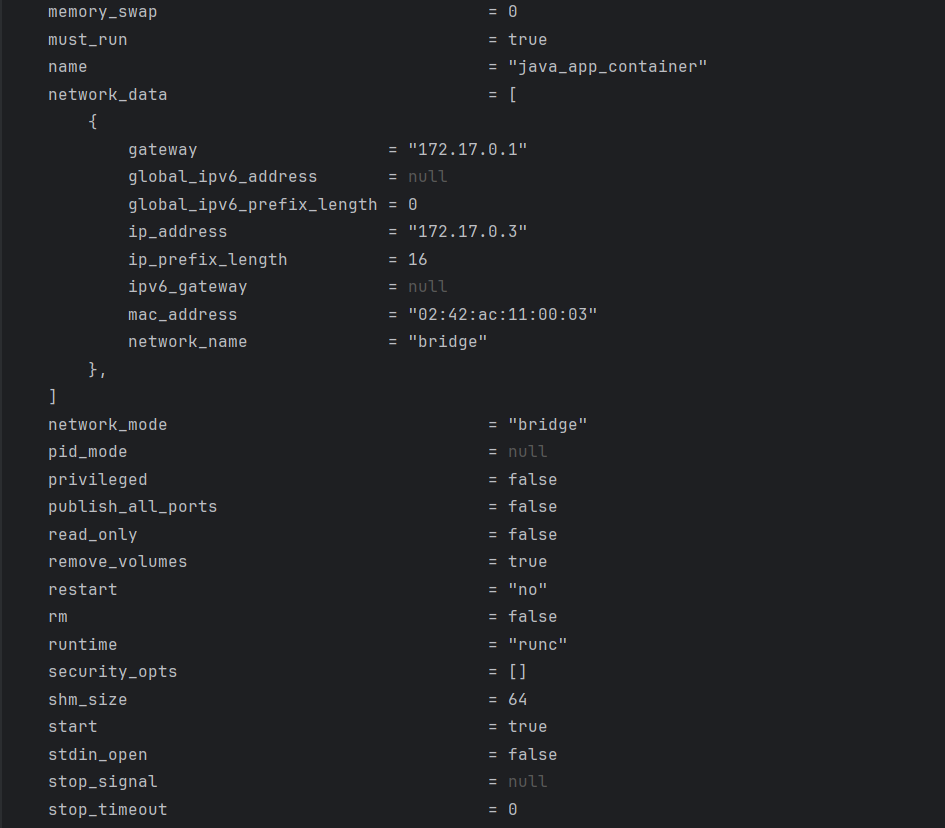
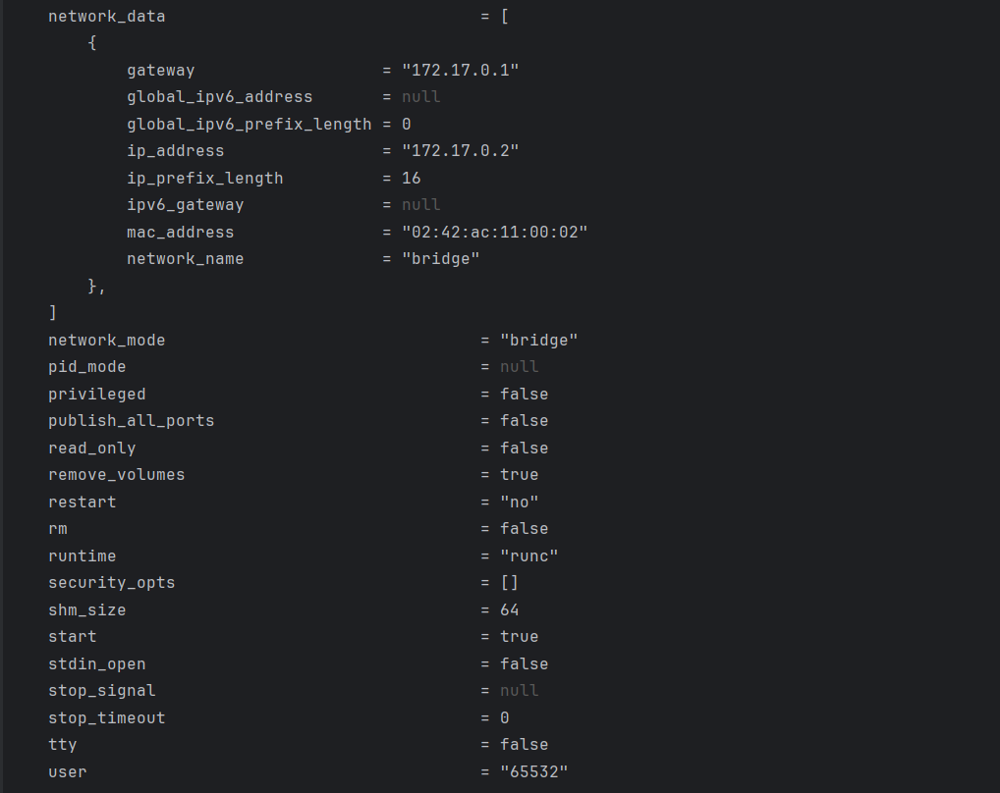
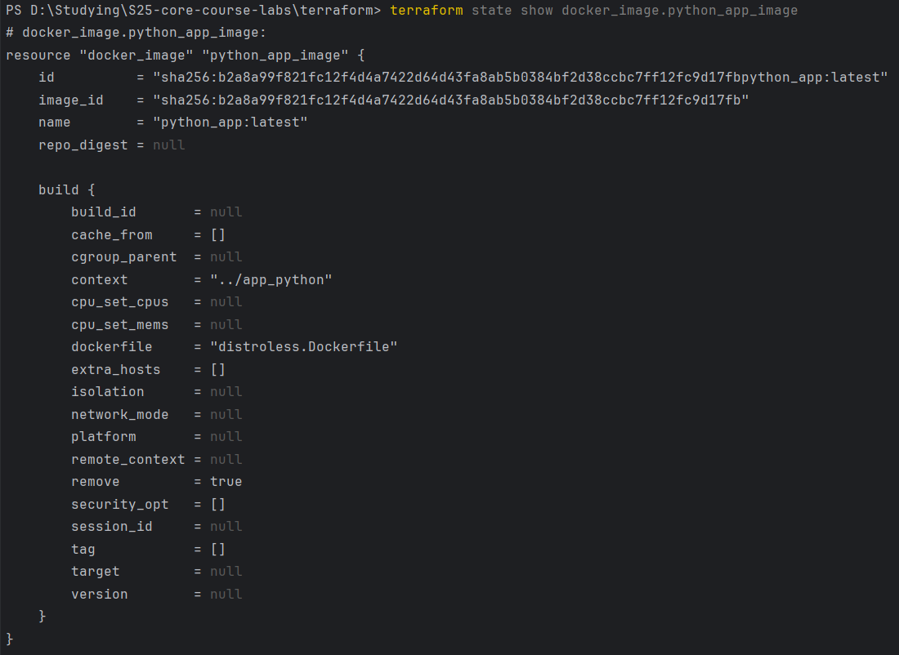
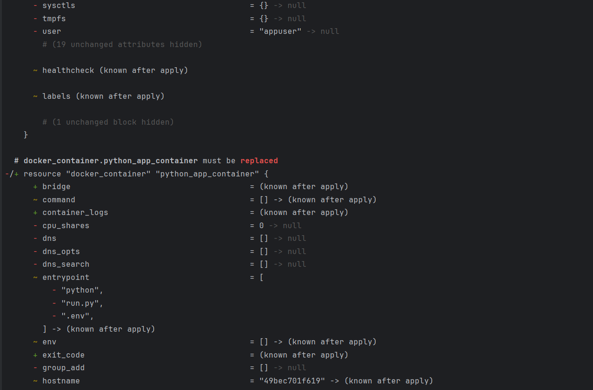
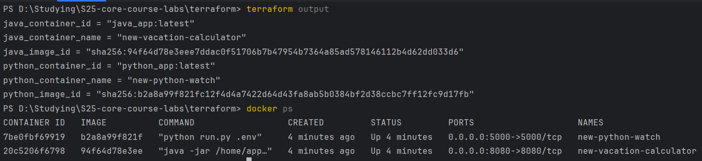

# Terraform

---

This is my first time when I really used terraform in practice, so there can be any inconveniences in configuration.
Please give your advices to me how to better implement such tools because I want to see myself as a devops in the future
(as on of the possible ways).

---

## `terraform state list`

---

## 'terraform state show <state_list_entry_i>'

* `java_app_container`

---

* `python_app_container`

---

* `docker_image.java_app_image`

---

* `docker_image.python_app_image`

---

## Changing names of the containers

---

## `terraform output`

---

## Usage of Yandex.Cloud Provider

