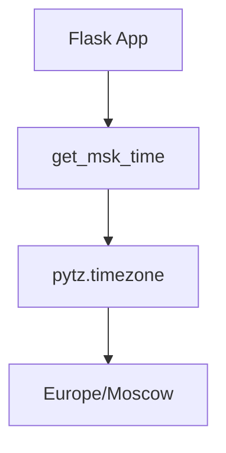

# Python Implementation Details

## Architecture


## Best Practices

### 1. Framework Choice
**Flask** was selected for:
- Minimal boilerplate
- Built-in WSGI server
- Extensibility via Blueprints

### 2. Virtual Environment
```bash
# Create isolated environment
python -m venv venv

# Freeze dependencies
pip freeze > requirements.txt
```

### 3. Code Quality
- **PEP8 Compliance**: Enforced via `flake8`

```yaml
# CI workflow step
- name: Lint
  run: flake8 . --count --statistics
```

- **Type hints** for critical functions:

```python
def get_msk_time() -> datetime:
    return datetime.now(pytz.timezone('Europe/Moscow'))
```

### 4. Testing Strategy
**Tools:**
- `pytest`: Test runner
- `freezegun`: Time mocking

**Test Cases:**

```python
# Validate timezone offset
@freeze_time("2024-01-01 12:00:00")  # UTC
def test_winter_time():
    assert get_msk_time().hour == 15  # UTC+3

# Check formatting
def test_time_format():
    assert len(get_msk_time().strftime('%H:%M:%S')) == 8
```

### 5. Timezone Management
- **Server Agnostic**: Avoids system time dependency
- **DST Handling**: Automatic adjustment via `pytz`
- **ISO 8601**: Standardized output formatting


---

# Upgrade Application for Persistence

### Overview

This application has been upgraded to include a persistent counter that tracks the number of times the main page (`/`) is accessed. The count is saved in a file named `visits`, and a new endpoint `/visits` has been added to display this count.

---

### Features

- **Persistent Visit Counter**  
  Tracks and saves the number of times the app has been accessed to a file named `visits`.

- **New Endpoint `/visits`**  
  Displays the current visit count saved in the `visits` file.

---

### How It Works

- Each time the root route `/` is accessed, the counter is incremented.
- The current counter value is stored and updated in a file named `visits`.
- The `/visits` endpoint reads from this file and returns the number of visits.

---

### Setup

#### 1. Clone the Repository

```bash
git clone -- branch lab12 <your-repo-url>
cd <project-directory>updated_lab12/monitoring
```
#### 2. Run with Docker Compose
Ensure Docker is installed, then run:

```bash
docker compose up
```
3. Access the Application
Visit the main page at: http://localhost:5000

View the visit count at: http://localhost:5000/visits

Docker Configuration
The docker-compose.yml file has been updated to mount a volume to persist the visits file:

```yaml
volumes:
  - ./visits:/app_python/visits
```
This allows the visit count to be visible and persistent on the host machine.

Validation
After accessing the app:

The visits file is updated correctly inside the container and is also visible on the host.

The /visits endpoint accurately reflects the visit count.

Verified using:

```bash
docker exec -it <container_id> cat /app_python/visits
```
Example Output


