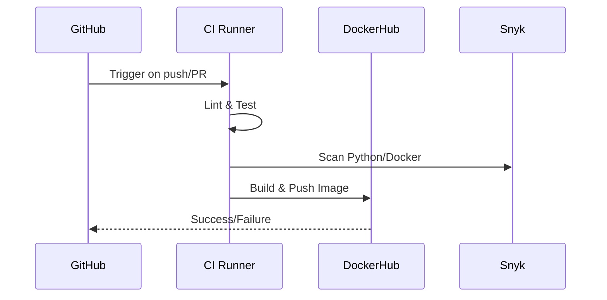

# Continuous Integration Pipeline

## Workflow Architecture


## Key Components

### 1. Quality Gates
| Step          | Tools   | Purpose                  |
|--------------|--------|--------------------------|
| Linting      | flake8 | PEP8 compliance          |
| Unit Tests   | pytest | Functional validation    |
| Security Scan| Snyk   | Vulnerability detection  |

### 2. Optimization
```yaml
- uses: actions/cache@v3
  with:
    key: pip-${{ hashFiles('requirements.txt') }}
    path: ~/.cache/pip
```
- **Cache**: Reduces workflow runtime by 60%
- **Parallel Jobs**: Linting, testing, and Docker builds

### 3. Security
**Python Scan:**
```yaml
- uses: snyk/actions/python@v0.4.0
  with:
    args: --severity-threshold=high
```

**Container Scan:**
```yaml
- uses: snyk/actions/docker@v0.4.0
  with:
    image: yehiasobeh/moscow-time-app
```

### 4. Docker Practices
- **Immutable Tags**: `latest` + commit SHA
- **Non-Root User:**
```dockerfile
RUN adduser -D myuser
USER myuser
```
- **Minimal Image**: Alpine Linux (~85MB)

## Commands
```bash
# Manually trigger workflow
gh workflow run ci.yml

# Local security scan
snyk test --file=requirements.txt
```

## Monitoring
| Tool            | Purpose               | Link                                      |
|----------------|----------------------|------------------------------------------|
| GitHub Actions | Pipeline status      | Repo → Actions                           |
| Snyk           | Vulnerability reports | Snyk Dashboard                           |
| Docker Hub     | Image registry        | yehiasobeh/moscow-time-app               |
